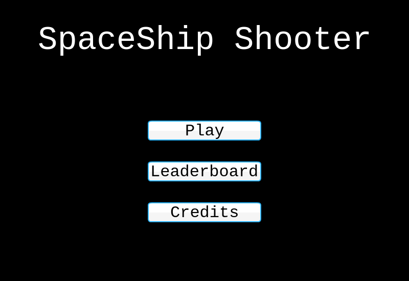
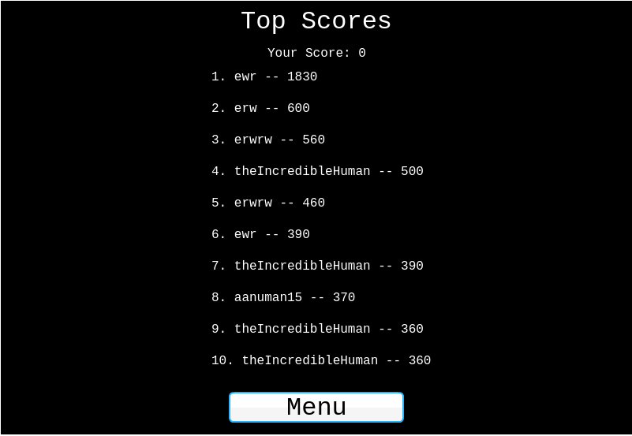
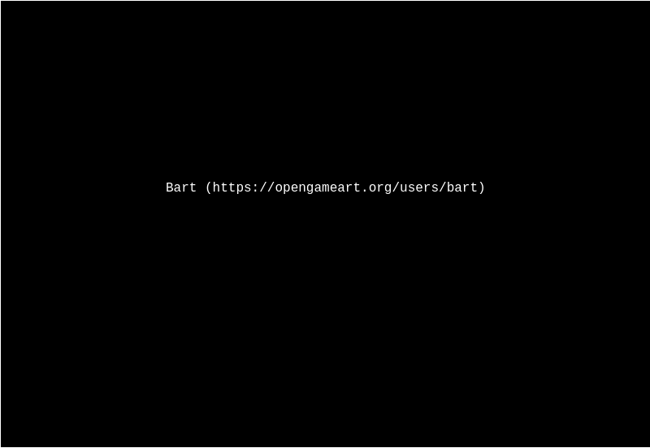
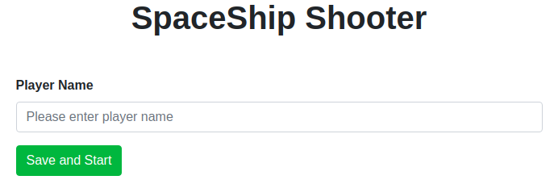

# SpaceShip Shooter Documentation

## **Content**
1. [SpaceShip Shooter Documentation](#spaceship-shooter-documentation)
2. [Content](#content)
3. [Story](#story)
4. [Characters](#characters)
5. [Scenes](#scenes)
6. [Game Instructions](#game-instructions)
7. [Troubleshooting](#troubleshooting)

## **Story**
This game is about surviving attacks by alien spaceships. You can either avoid them or score points by shooting them or score higher points by combining both.

## **Characters**
### **PlayerShip**
The PlayerShip is a human SpaceShip.

#### **Skills**
1. Moves in all directions
2. Shoots up to 4 laser a second

### **AlienShip**
The AlienShip is an alien SpaceShip of unknown origin.

#### **Skills**
1. Moves downwards
2. Shoots one laser per second
- An new AlienShip appears after each second

## **Scenes**
This game has three notable scenes:
1. `Menu` scene
2. `Leaderboard` scene
3. `Credits` scene

### **Menu Scene**
The menu scene has three buttons:
1. `Play` button starts the game
2. `Leaderboard` button gives the list of top scores
3. `Credits` button leads to the Credits Scene

### **Leaderboard Scene**
This scene lists the top 10 scores played so far in the game. All game scores are stored in a [Leaderboard API](https://us-central1-js-capstone-backend.cloudfunctions.net/api/) endpoint created particularly for this game.

The game sends all the scores to the endpoint along with your player name, after a game is over. If you make it to the first ten, you will see your score in the `Top Scores` list.

- You'll need to be connected to the Internet while in the `Leaderboard` scene in order to view the `Top Scores` list

### **Credits Scene**
This scene is dedicated to acknowledge the use of open source materials and appreciate the work of third parties. Most notably:
- [Kenney Vleugels](https://opengameart.org/users/kenney)
- [StumpyStrust](https://opengameart.org/users/stumpystrust)
- [Bart](https://opengameart.org/users/bart)

## **Game Instructions**

### **Start Game**
In order to play the game, use one of the following links:
- Open `http://localhost:8080/` in your browser and navigate around the site
OR
Visit the [Live Demo](https://rawcdn.githack.com/anewman15/spaceship-shooter/97bd660c6f2d3f82a708e62480a48243516095fc/build/index.html) link
- Follow the instructions below

### **Create Player**
1. Use the form to create a player by entering name so you can track your score in the Leaderbord.

2. To start the game, click on the `Play` button in the `Menu` scene.
- In case you don't create a player, the default player name is `theIncredibleHuman`

### **Play Scene**

The `Play` scene shows
1. The player name in the top-left corner of the screen, i.e. the player name you entered in [Create Player](#create-player)or by default `theIncredibleHuman`
2. The score in the top-right corner

The `Play` scene creates
1. The Player Ship shown at the center-bottom of the screen
2. Lasers shot by the Player Ship when `SPACE` key is pressed `down`
3. Enemy Ships moving down from top. Enemy ships position themselves randomly across the width of the game sceen
4. Lasers shot by the Enemy Ship at regular intervals

- Player lasers are lethal for Enemy ships
- Enemy lasers are lethal for Player Ship
- Player scores `10` points for each destroyed Enemy Ship
- Player Ship is able to move right, left, up and down using the controls described in [Controls](#controls)

### **Controls**
1. Press `A` to move left
2. Press `F` to move right
3. Press `E` to move up
4. Press `X` to move down
5. Press `SPACE` to shoot

In order to **continue** doing the above actions keep pressing the respective keys `down`

### **Scoring**
1. Each downed Enemy Ship earns the Player 10 points
2. The Player dies when hit once by Enemy Ship or Enemy laser

- Scores are sent to the API in the `Game Over` scene
- You'll need to be connected to the Internet in order for your score to be saved
- If your score is high enough, it will appear in the `Top Scores` in the `Leaderboard` scene

## **Troubleshooting**

### Leaderboard Issues
If you are not able to view the `Top Scores` list in the `Leaderboard` scene, please check your Internet connection. You connection should be active while you are in the `Leaderboard` scene.
